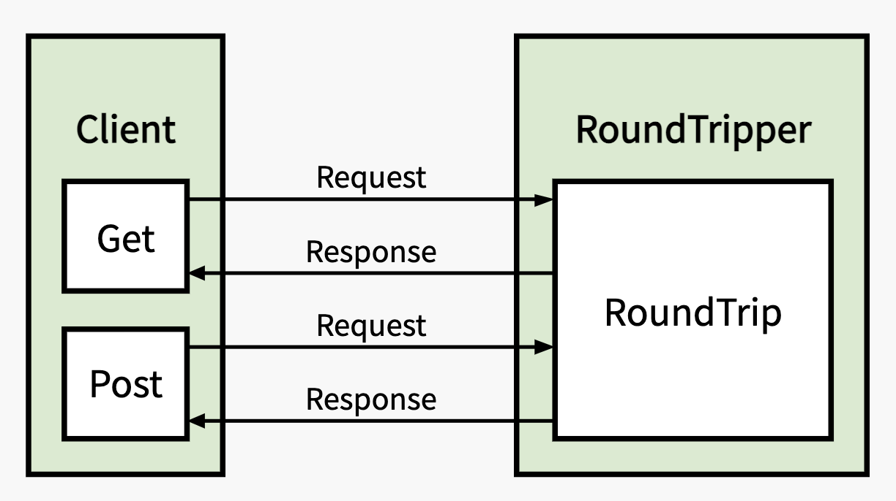
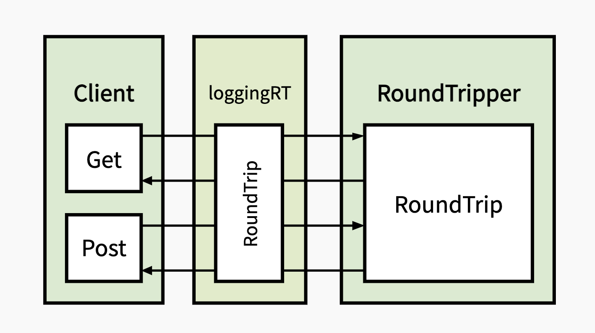
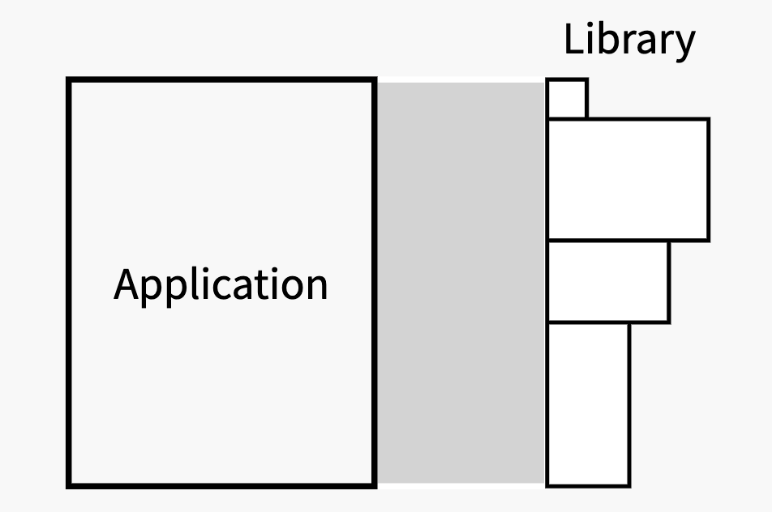
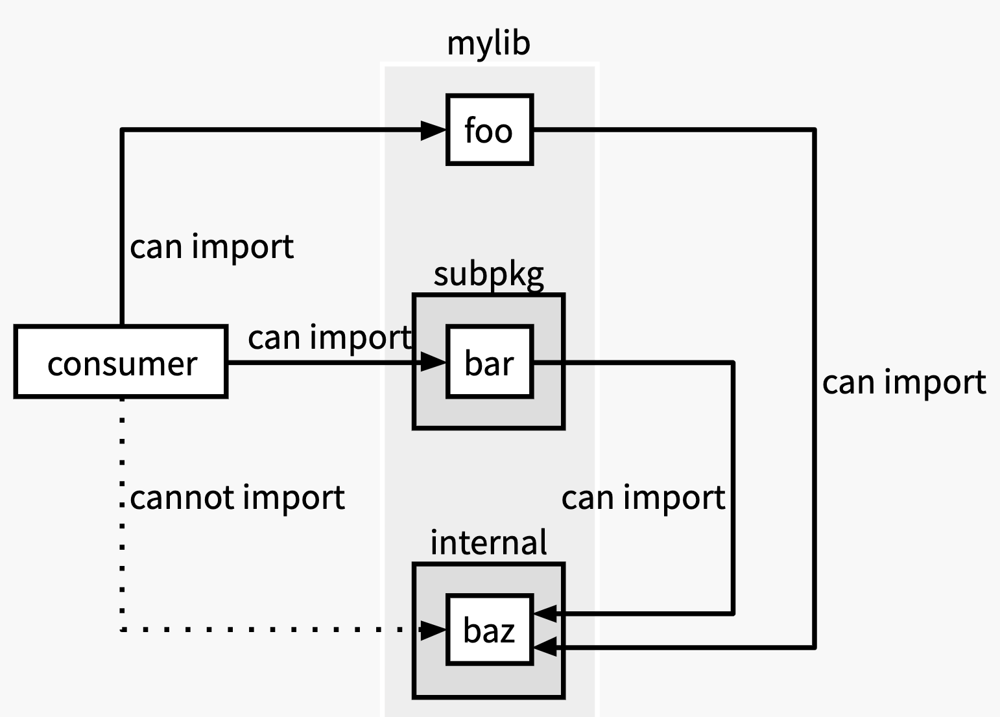
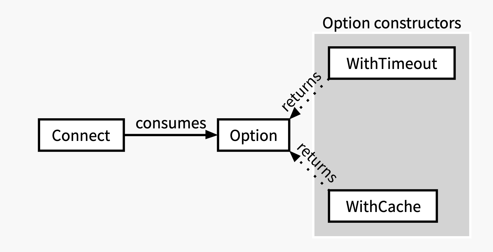

# Designing Go Libraries: The Talk: The Article

Tags: golang

## Table of Contents

This is a long-form version of a talk I gave in 2018 providing guidance on designing libraries in Go.

📝 NOTE
Before diving in, please note that:

- The Go ecosystem has evolved since I gave this talk in 2018. However, minus the Errors section, the information in this article is still 'current' as of writing this.
- The article does not go into great depth on any particular subject — it’s already quite long. Some of the ideas discussed here could be explored in more detail in future articles.

## Agenda

We’ll discuss the following topics today:

- Primary Concerns
    axes to maximize when designing a library

- Backwards compatibility
    what backwards compatibility means for Go

- Recommendations
    recommendations on how to go about designing a library

But first, a tangent…​

***Do you need to write it?***

Owning and maintaining a library can be a significant undertaking. The work does not end once the code is written — there is often a never-ending stream of bug fixes, feature requests, new use cases, and integration work that needs to be done. This is true even for libraries that are only used internally within a company. In fact, the more popular and actively used a library is, the more new work it is likely to generate. Maintaining a library is a continuous process, and it’s never truly "done" as long as it’s in production.

Therefore, before embarking on the journey of writing and maintaining your own library, consider whether there are existing open source alternatives that could meet your needs.

Speaking of open source libraries…​

***Vet your open source libraries***

When considering the use of an open source library, look inside and evaluate:

- Does the code quality meet your standards?
- Does it have automated testing?
- Is the documentation up-to-date?
- Is the library actively maintained?

These are all important but the last one — active maintenance — is critical. Using and improving an unmaintained library may result in your contributions going unacknowledged and wasted. Therefore, be sure to verify that the library is actively maintained, or be prepared to fork it and take on the maintenance yourself.

***Open source entitlement***

Lastly, it’s important to understand that most open source maintainers are volunteers. Even projects owned by large companies may not have paid maintainers. It’s essential that you approach open source projects with a sense of collaboration and willingness to contribute, rather than with a sense of entitlement. If you’re not paying the maintainers, you are not entitled to their time and effort. So be prepared to work alongside them to improve the project to fulfill your needs.

Okay, back on topic.

## 1. Primary Concerns

This section discusses the axes you should aim to maximize when designing your library.

### 1.1. Usability

> Make interfaces easy to use correctly and hard to use incorrectly.

> — Scott Meyers

Usability defines the core experience of using your library. Under this axis, consider factors such as:

- discoverability and clarity in naming
- potential for misuse
- ease of accomplishing common tasks

To maximize usability, think about convenience and conventions while designing your APIs.

#### Case Study: net/http

Let’s take a concrete example from the standard library. This is how you make a simple HTTP GET request using net/http.

***Sending a GET request***

```go
// import "net/http"

// ① build a new HTTP request with the HTTP GET method
req, err := http.NewRequest(http.MethodGet, "http://example.com", nil /* body */)
if err != nil {
  return err
}

// ② initialize an HTTP client
var client http.Client

// ③ send the request
res, err := client.Do(req)
// ...
```

That seems like a lot of code to do something so simple. That’s because I lied. Sending a GET request is a frequent enough need that net/http includes an easier way: the [Client.Get](https://pkg.go.dev/net/http#Client.Get) method. That turns the above into the following.

***Sending a GET request — take two***

```go
// import "net/http"

var client http.Client
res, err := client.Get("http://example.com")
```

That’s better but we can go further: we can use the [http.Get](https://pkg.go.dev/net/http#Get) function, which uses a global client.

***Sending a GET request — easiest way***

```go
// import "net/http"

res, err := http.Get("http://example.com")
```

***🚨WARNING***

Don’t use this version (the http.Get function) in libraries — they should not consume the global HTTP client. Instead, have the user inject an HTTP client into your library and use the Get method on that.

Best practices like these are discussed further in Recommendations.

Looking at the code samples above, we see a pattern: the Client.Get method is named after the HTTP GET method, and there’s an http.Get function version of it that uses the global HTTP client. Could it be a convention that popular HTTP request methods get a method on Client and a top-level function based on the default client?

If you look inside the [http package](https://pkg.go.dev/net/http), you’ll find that to be true.

```go
package http

type Client
  func (c *Client) Head(url string) (resp *Response, err error)
  func (c *Client) Post(url, contentType string, body io.Reader) (resp *Response, err error)

func Head(url string) (resp *Response, err error)
func Post(url, contentType string, body io.Reader) (resp *Response, err error)
```

These conventions aid in usability and discoverability. A user can guess their way to the http.Get or http.Post functions, or if given an HTTP client, to the methods. From there, their editor’s autocompletion system will help them fill in the blanks, and if they get stuck, they know exactly what to look up in the documentation.

These APIs make it easy to accomplish common tasks, leaving us with the escape hatch of using h[ttp.Request](https://pkg.go.dev/net/http#Request) with [Client.Do](https://pkg.go.dev/net/http#Client.Do) for everything else.

So to reiterate:

- make common tasks easy
- make uncommon tasks possible
- establish conventions to aid in discoverability

### 1.2. Readability

> Code is read much more often than it is written, so plan accordingly
> — Raymond Chen

Code readability is essential for maintaining a system over time. Systems that prioritize code readability will be easier for future developers to work with, requiring less effort to use and modify, further extending the lifespan of the system.

As a library author, you can help your users produce readable code and maintainable systems by designing clean APIs. You can achieve this through clear and descriptive naming, and with APIs that do not clutter their code.

A good way to begin building readable APIs is to write pseudo-code and documentation before the implementation. Write pseudo-code that uses the API, think about the outcome for different inputs, and turn your insights from that exercise into documentation for the API. Only then, should you begin implementing it. This will give you a sense of how the API will be used, and let you tweak and improve the experience before you put effort into the implementation, or get attached to a specific API or behavior. By making this a habit, you will built a better intuition for library design so that over time you need to do this less often.

### 1.3. Flexibility

Flexibility is a form of future-proofing your library. Flexibility of a library determines whether new features can be added to it to satisfy new use cases, and whether users can customize and extend it to bend it to their needs.

To achieve flexibility, consider the architecture of your library and how you present that to users through its API. Think about the core concepts — the vocabulary — of the library and their responsibilities. A well-architected library will lend itself to flexible APIs and composable abstractions that integrate well with other systems, and may develop an ecosystem of third-party extensions around it.

***Case Study: net/http***

Let’s look at [http.Client](https://pkg.go.dev/net/http#Client) again. This is how we used it earlier:

```go
var client http.Client
res, err := client.Get("http://example.com")
```

I’d like to modify the HTTP client to log information about a request before sending it.

Per the documentation for http.Client:

```go
package http

type Client struct {
  // Transport specifies the mechanism by which individual
  // HTTP requests are made.
  // If nil, DefaultTransport is used.
  Transport RoundTripper
  // ...
}

type RoundTripper interface {
  RoundTrip(*Request) (*Response, error)
}
```

That tells us that every HTTP client is backed by an [http.RoundTripper](https://pkg.go.dev/net/http#RoundTripper) and individual methods on the client (Get, Post, Do) pass the HTTP request onto the RoundTripper.



By default, the HTTP client uses [http.DefaultTransport](https://pkg.go.dev/net/http#DefaultTransport) — but we can change that. We can introduce a custom RoundTripper implementation that logs information about the request before passing it onto the default transport.

```go
type loggingRT struct {
  http.RoundTripper
}

func (rt *loggingRT) RoundTrip(
  req *http.Request,
) (*http.Response, error) {
  log.Printf("%v %v", req.Method, req.URL)
  return rt.RoundTripper.RoundTrip(req)
}
```

```go
roundTripper := &loggingRT{
  RoundTripper: http.DefaultTransport,
}
client := http.Client{
  Transport: roundTripper,
}
res, err := client.Get("http://example.com")
```



The separation between HTTP client and transport in net/http is an architectural choice that also results in a flexible public API.

Obviously, there are limits to how far your library should bend in its pursuit of flexibility. I’ve found that these limits are clearer if you solidify the architecture, the different abstractions, and their responsibilities.

### 1.4. Testability

Automated testing is another critical piece that makes systems maintainable. It not only ensures that a system works, but that it keeps working as you update and change it.

If the design of a library makes it difficult to test code that uses it, many users simply will not test that code. In building your library, aid your users in testing its correct usage by answering the following questions:

- Is your library flexible enough to let users swap relevant components out with test fakes?
- Do you need to expose packages with testing utilities?[1]

Don’t make testability an afterthought. Think about it at design time.

### Summary

So the four axes we’re aiming to maximize are:

- Usability: is it easy to use
- Readability: is its usage easy to read
- Flexibility: is it easy to extend
- Testability: is its usage easy to test

## 2. Backwards compatibility

Backwards compatibility, in the context of a library, is the ability of newer versions of the library to operate with code written against an older version without any changes to that code.

Commitment to backwards compatibility can be a major deciding factor in the adoption of a library. If a library constantly makes breaking changes, users will get frustrated from having to constantly update their code. Eventually, they’ll migrate to a more stable library. Therefore, backwards compatibility is strongly desirable for a library.

On the other hand, unlimited backwards compatibility is too limiting. Unlimited backwards compatibility stops us from using new language features, taking advantage of new APIs in the standard library, or paying down past technical debt. There needs to be a balance between absolute backwards compatibility and the chaos of unversioned libraries.

We can find this balance — make backwards compatibility easier — if we set clear expectations on how far back we’re willing to go.

[Go 1 and the Future of Go Programs](https://go.dev/doc/go1compat) sets expectations with regards to backwards compatibility for Go and its standard library. We can adopt something similar for libraries:

- Limit supported versions of Go to the current and previous minor releases[2]. For example, if Go 1.12 is the latest release, then only Go 1.12 and 1.11 are supported. This allows libraries to use new features in Go and its standard library within a reasonable time frame, while still supporting consumers that are lagging behind on upgrades.
- Redefine what constitutes a breaking change to something more reasonable than, "anything that requires users to change their code." This is covered briefly in [Breaking changes](https://abhinavg.net/2022/12/06/designing-go-libraries/#breaking-changes).
- Require that all libraries follow [Semantic versioning](https://abhinavg.net/2022/12/06/designing-go-libraries/#semantic-versioning). This establishes a consistent language between maintainers and users to talk about the stability of a library and changes to it.

### 2.1. Breaking changes

[Go 1 and the Future of Go Programs](https://go.dev/doc/go1compat) discusses this in more detail but, in short, an API breaking change to a package in Go is any of the following:

- renaming or removing an exported entity, or changing its type
- any change to an exported method or function signature
- adding a new method to an exported interface
- behavioral changes that violate an established contract

Most other changes are considered backwards-compatible even if they cause users to update their code.

***Adding a method to an interface is a breaking change***

This can be surprising. Adding a new method to an exported interface is a breaking change because it means that existing implementations of that interface are no longer compliant with it.

As an example, consider a library that publishes a Client interface in a stable release. The library gains traction, and users build extensions and customizations on top. These include custom implementations of the Client interface, like a wrapper that records metrics, a test fake, or a mock. If, at this point, we publish a new release of the library that adds a new method to the Client interface, that will break all such third-party implementations.

Therefore, once an interface is published in a stable release, it cannot be changed. This is discussed more in [Interfaces are forever](#37-interfaces-are-forever).

### 2.2. Semantic versioning

> At this point in the talk, I went over the basics of semantic versioning. I’m not going to repeat that here. If you’re not familiar with semantic versioning, check out [Bare minimum semantic versioning](https://abhinavg.net/2022/11/07/semver/), which covers those basics.

Semantic versioning allows maintainers to communicate clearly about the stability of a library: pre-1.0 releases are considered unstable and those above stable. It gives them room to experiment during the unstable period and encourages them to commit to stability afterwards. If a breaking change is required, it allows them to communicate this with consumers in a way that they are not surprised by those breakages.

Despite all this, it cannot alleviate the cost of breaking changes — it cannot make the migrations disappear.

Breaking changes to a library are expensive, extremely so if the library is widely used and has a thriving ecosystem because it will take the ecosystem some time to migrate. Even breaking changes to a company-internal library can be expensive because they divert attention from more important business goals. So, again, breaking changes to a library are expensive.

We should aim to avoid breaking changes for as long as possible.

## 3. Recommendations

With that in mind, and the concerns for library authors discussed previously, let’s talk about some recommendations for libraries.

Scope       | Recommendation
------------|---------------------------------------------------------------------------------------------------------------------------------------------------------------------------------------------------------------------------------------------------
Project     | [Work backwards](#31-work-backwards) [Minimize surface area](#32-minimize-surface-area) [Avoid unknown outputs](#33-avoid-unknown-outputs) [No global state](#34-no-global-state)
Abstraction | [Accept, don’t instantiate](#35-accept-dont-instantiate) [Accept interfaces](#36-accept-interfaces) [Interfaces are forever](#37-interfaces-are-forever) [Return structs](#38-return-structs) [Upgrade with upcasting](#39-upgrade-with-upcasting)
Functions   | [Parameter objects](#310-parameter-objects) [Functional options](#311-functional-options) [Result objects](#312-result-objects)
Behavior    | [Errors](#313-errors) [Goroutines](#314-goroutines) [Reflection](#315-reflection)
Entity      | [Naming](#316-naming)
Maintenance | [Documentation](#317-documentation) [Keep a changelog](#318-keep-a-changelog)

> 📢 IMPORTANT
> There are exceptions to everything I discuss below.

### 3.1. Work backwards

When designing a new API, start with the desired usage and work backwards towards the implementation.

One way to do this is by writing pseudo-code that consumes the new API to get a sense of how it will be used. During this phase, consider all [primary concerns](#1-primary-concerns). Think about questions like the following:

- Can you tell what the API will do just by looking at the usage, without needing to know the implementation?
- Is there room for misuse?
- How will you test this usage to ensure it’s working as intended?
- Depending on the complexity of the design, exercise its flexibility by sketching out a skeleton for a potential future feature or third-party extension. Is it flexible enough?
- What’s the contract of the API? That is, what does it expect from its inputs, and what guarantees does it provide for its outputs?

Only after you have a rough sketch for the design should you begin implementing the new API. Thinking about these details early helps avoid surprises later. It ensures that the design guides the implementation, not the other way around.

As you flesh out details, you might find that your design doesn’t fit perfectly. That’s completely fine! The design isn’t immutable. Go back, tweak it, validate it, and continue implementing it.

### 3.2. Minimize surface area

Surface area refers to the public APIs your library exposes — all possible touch points that an application could have with your library.




The smaller the surface area, the more internal flexibility you get in your library. A larger surface area reduces how much you can refactor or modify, and commits you to keeping more things stable.

For most libraries, you should start with the smallest possible surface area in initial versions. As the library grows more stable and popular, and new features are added, the surface area grows organically.

Minimizing the surface area isn’t just for initial versions. Make it a practice to be deliberate about the APIs you export from your library, because once exported in a stable release, you cannot take them back. Don’t export something that satisfies a "maybe" use case — export it only when a compelling use case presents itself.

In short, when in doubt, leave it out.

***Case Study***

As an example, consider the following from a 0.X release of a library my team maintained:

```to
type Value struct{ /* ... */ }
  func (*Value) AsBool() bool
  func (*Value) AsFloat64() float64
  func (*Value) AsInt() int
  func (*Value) AsString() string
  func (*Value) Populate(target interface{}) error
  func (*Value) TryAsBool() (_ bool, ok bool)
  func (*Value) TryAsFloat64() (_ float64, ok bool)
  func (*Value) TryAsInt() (_ int, ok bool)
  func (*Value) TryAsString() (_ string, ok bool)
```

The methods behave roughly as follows:

- TryAs*
    try to convert the value to the corresponding type, returning false if the operation failed.
- As*
    try to convert the value to the corresponding type, panicking if the operation failed.
- Populate
    decode the value into a pointer (like json.Unmarshal), returning an error if the operation failed.

Even without looking at the implementations, you can probably guess at them:

<table>
<thead><tr><th>As*</th><th>TryAs*</th></tr></thead>
<tbody>
<tr><td>

```go
func (v *Value) AsInt() int {
  i, ok := v.TryAsInt()
  if !ok {
    panic("cannot convert to int")
  }
  return i
}
```

</td><td>

```go
func (v *Value) TryAsInt() (_ int, ok bool) {
  var i int
  if err := v.Populate(&i); err != nil {
    return 0, false
  }
  return i, true
}
```

</td></tr>
</tbody>
</table>

All those type-specific methods are redundant because you can do the same with Populate. In fact, we found that their usage was quite rare — most users did indeed call Populate directly.

Since this was a pre-1.0 library, we were able to reduce the surface area of Value to the following before tagging a 1.0 release.

```go
type Value struct{ /* ... */ }
  func (*Value) Populate(target interface{}) error
```

We agreed that we’d add the type-specific helpers back if enough users asked for them. We never needed to — users were happy with Populate.

#### 3.2.1. Internal packages

Any package you expose in your library is part of its permanent contract. A tool you can use to [reduce the surface area](#32-minimize-surface-area) of your library is internal packages.

Go packages inside an 'internal' directory can be imported from the directory’s direct parent and the parent’s other descendants. This allows other components in your library to import these packages, but hides them from users of your library.



Use internal packages liberally to control the surface area of your library. Place packages that are not part of your library’s core responsibilities, helpers and utilities written to aid in implementing the library, packages created just for better code organization but not meant to be part of the public API, all into an internal directory.

> 📢 IMPORTANT
>
> If you use internal packages, do not expose internal entities in exported, non-internal APIs. For example, if you have internal/foo, do not export a function from your library that references foo.Bar — that makes it impossible for users to reference that function signature.

### 3.3. Avoid unknown outputs

> In the original version of this talk, this section was named "Avoid undefined behaviors." I’ve renamed it to "Avoid unknown outputs" since this section is largely concerned with outputs.

Unknown outputs refers to outputs from a library, the value for which is not clearly specified. This could be output that is non-deterministic, or output that is partially valid in error cases.

As a general rule, aim to reduce unknown outputs from your library because someone will eventually begin relying on the exact output, making it part of the contract of the API.

As Hyrum’s Law puts it:

> With a sufficient number of users [..] all observable behaviors [..] will be depended on by somebody.
>
> — Hyrum’s Law

***Hyrum’s Law: Real world example***

> My team owned a parser for a text-based format. Our parser had a bug that allowed reserved keywords to be used as names, which was against the specification for the format. However, the parser still considered these files valid.
>
> A few months later, we realized that the bug existed because our biggest user had many files that were affected by it — they used reserved keywords as names. Unfortunately, they had built an ecosystem of tools and libraries based on these technically invalid files.
>
> We couldn’t fix the bug without invalidating the entire ecosystem that they had built, so we had to keep the bug/feature as it was.

There’s no way to completely eliminate unknown outputs, but the following practices can move you in the right direction:

***Reduce input range***

Validate input at entry points and be restrictive about what you accept. You can always loosen restrictions later.

***Guard against unexpected mutation***

If an API accepts or returns a slice or a map, consider what happens if the caller changes the collection afterwards. Is the slice referencing internal state for an object? You can guard against issues from this by cloning the slice or map at the API boundary. Obviously, be careful about where you use this and how it affects performance.

***Return zero values with errors***

When an operation fails and you need to return an error and a value, instead of returning a partial value (e.g. return x, err), return the zero value of that type (e.g. return nil, err) — except when partial results are part of the contract of the function, as with [Writer.Write](https://pkg.go.dev/io#Writer.Write).

***Think about ordering***

When returning slices, consider the order of items in the slice. Is the order part of the contract of that result? Or is it just determined by some internal state, changing which could break someone? In these cases, consider sorting the slice at the API boundary.

### 3.4. No global state

There are very few good reasons for a library to have global state. Global state makes testing more difficult and tightens coupling between components. Global state without an escape hatch — a way to localize it — reduces flexibility. For those and many other reasons, do not use global state in your libraries.

If your library needs state, put that inside an object. Turn the top-level functions that use this state into methods on the object.

<table>
<thead><tr><th>Bad</th><th>Good</th></tr></thead>
<tbody>
<tr><td>

```go
var cache map[string]*Value // ①

func init() {
  cache = make(map[string]*Value) // ②
}

func Lookup(name string) (*Value, error) {
  if v, ok := cache[name]; ok {
    return v, nil // ③
  }
  // ...
  v := /* ... */
  cache[name] = v // ④
  return v, nil
}
```

- ① A global map to store cached values.
- ② Initialize the map in an init() function.
- ③ Return the cached value if there’s a hit.
- ④ Otherwise, calculate the value and update the cache.

</td><td>

```go
type Handle struct {  // ①
  cache map[string]*Value // ②
}

func NewHandle() *Handle { // ③
  return &Handle{
    cache: make(map[string]*Value),
  }
}

func (h *Handle) Lookup(name string) (*Value, error) { // ④
  if v, ok := h.cache[name]; ok {
    return v, nil
  }
  // ...
  v := /* ... */
  h.cache[name] = v
  return v, nil
}
```

- ① Define an object to hold the state.
- ② Turn the global map into a field on the object.
- ③ Initialize the map inside a constructor instead of init().
- ④ Turn the top-level function into a method on the object.

</td></tr>
</tbody>
</table>

### 3.5. Accept, don’t instantiate

Dependencies of your library — things that "someone else" does — should be passed in as arguments at appropriate entry points. For example, your library should not establish a database connection if that’s not its purpose. Instead, it should accept a connection that was already establish as an argument somewhere. In short, don’t instantiate what you don’t own.

<table>
<thead><tr><th>Bad</th><th>Good</th></tr></thead>
<tbody>
<tr><td>

```go
func New(fname string) (*Parser, error) {
  f, err := os.Open(fname)
  // ...
}
```

The caller can only change the file name. They must always write a static file to disk.

</td><td>

```go
func New(f *os.File) (*Parser, error) {
  // ...
}
```

The caller can satisfy the common use case of static files, but also pass in [os.Stdin](https://pkg.go.dev/os#Stdin), or the read half of a [os.Pipe](https://pkg.go.dev/os#Pipe).

If the static file case is a common enough need, we can add the following function for convenience:

```go
func NewFromFile(fname string) (*Parser, error) {
  f, err := os.Open(fname)
  if err != nil {
    return nil, err
  }
  return New(f)
}
````

</td></tr>
</tbody>
</table>

The second variant is an improvement over the first, but I think we can do better. That brings us to…​

### 3.6. Accept interfaces

Accept interfaces for complex objects whose behavior you consume so that you’re not coupled to a specific implementation of that functionality. Doing so provides your users more flexibility and improves testability.

Improving on the previous example:

<table>
<thead><tr><th>Bad</th><th>Good</th></tr></thead>
<tbody>
<tr><td>

```go
func New(f *os.File) (*Parser, error) {
  // ...
}
```

The input must always be a file so tests must write a file to disk. It’s difficult to simulate read failures, and difficult to use non-file sources of input.

</td><td>

```go
func New(r io.Reader) (*Parser, error) {
  // ...
}
```

Narrows down to functionality we actually need. The input can be an in-memory buffer or a network stream. We can mock the interface to simulate any kind of failure.
</td></tr>
</tbody>
</table>

***You can declare your own interfaces***

You’re not limited to using interfaces defined elsewhere. You can declare your own interfaces for objects you consume — even if you don’t own those types.

For example, if New above additionally needs the file name, it’ll need access to the [Name](https://pkg.go.dev/os#File.Name) method. We can do something like the following:

```go
type Source interface {
  io.Reader

  Name() string
}

var _ Source = (*os.File)(nil) // ①

func New(src Source) (*Parser, error) {
  // ...
}
```

 ① This verifies that os.File implements the interface at compile time. See [Verify Interface Compliance](https://github.com/uber-go/guide/blob/master/style.md#verify-interface-compliance).

The function above will accept *os.File and any custom implementations of the interface.

Speaking of interfaces, library authors should internalize this:

### 3.7. Interfaces are forever

I mentioned this earlier in [Breaking changes](#21-breaking-changes), but I want to call it out explicitly.

> Any change to an exported interface is a breaking change.

Any change you can possibly make to an interface breaks someone.

***Adding a method***

breaks implementations of that interface that aren’t part of your library — see Adding a method to an interface is a breaking change for an example

***Removing a method***

breaks functions that consume the interface and call that method

***Changing a method signature***

breaks both, external implementations of the interface and callers of the method

So how do we get flexibility here? How do we add new functionality to an abstraction? See…​

### 3.8. Return structs

To keep your library flexible, return structs, not interfaces for core concepts in your library. This allows you to add new methods to the object in a completely backwards-compatible manner.

For example:

<table>
<thead><tr><th>Bad</th><th>Good</th></tr></thead>
<tbody>
<tr><td>


It’s not uncommon to see packages that take the following shape:

```go
type Client interface {  // ①
  Set(k string, v []byte) error
  Get(k string) ([]byte, error)
}

type clientImpl struct { // ②
  // ...
}
func (c *clientImpl) Set(...) error
func (c *clientImpl) Get(...) ([]byte, error)

func New(/* ... */) Client { // ③
  return &clientImpl{
    // ...
  }
}
```

- ① The core API of the package is defined as an interface.
- ② The behavior is implemented by a private type.
- ③ The constructor returns an instance of the private type.

This is inflexible because, among other things, we cannot modify the Client interface anymore — adding a method to it is a breaking change.

</td><td>

It’s better to export the concrete implementation and return an instance to it from the constructor.

```go
type Client struct { // ①
  // ...
}
func (c *Client) Set(...) error
func (c *Client) Get(...) ([]byte, error)

func New(/* ... */) *Client { // ②
  return &Client{
    // ...
  }
}
```

- ① Delete the interface and instead, export the struct that provides the core methods instead.
- ② The constructor returns a pointer to the struct.

This version is more flexible. We can add new methods to Client without breaking callers. Users who need to mock, wrap, or replace the struct implementation can still declare their own interfaces.

</td></tr>
</tbody>
</table>

### 3.9. Upgrade with upcasting

We just discussed a couple related topics for designing abstractions: [Return structs, Accept interfaces](#38-return-structs). Returning structs allows you to add new behaviors to the object. How do we grow the abstraction on the other end, though? How can we expect new behaviors from the interfaces we accept?

To get there, we need to first cover a feature of Go interfaces: Upcasting.

***Upcasting***

Upcasting is a way of casting a value from a 'lower' type — one with less information — to a 'higher' type with more information.

The syntax for it takes one of the following two forms:

```go
x := v.(T) // ①
x, ok := v.(T) // ②
```

- ① Panics if the operation fails.
- ② Sets ok to false if the operation fails.

Where v is an interface value of some kind, and T is either another interface, or a concrete type that implements the interface for v.

For example:

```go
var r io.Reader // ①
// ...
c, ok := r.(io.ReadCloser) // ②
if ok {
  _ = c.Close()
}

f, ok := r.(*os.File) // ③
if ok {
  fmt.Println("Processed", f.Name())
}
```

- ① Start with an io.Reader. We know very little about the object: only that it implements the Read method.
- ② Attempt to upcast it to io.ReadCloser. If the operation succeeds, we know that it also implements a Close method so we can call it.
- ③ Attempt to upcast it to *os.File. This is the most specific upcast we can do for this type; once we know it’s an *os.File, we know all its methods.

With upcasting in our hand, we have the tool we need to add a new method to an interface.

Recall the example from earlier.

```go
type Source interface {
  io.Reader

  Name() string
}

func New(src Source) (*Parser, error) {
  // ...
}
```

Suppose that the Parser wants to report meaningful error messages, so it needs to look up its current position inside Source. Maybe it can do this with a new Offset() int64 method that reports the current position in the file[3].

However, we cannot add this method to Source — that’s a breaking change.

```diff
 type Source interface {
   io.Reader

   Name() string
+  Offset() int64 // bad: breaking change
 }
```

To do this in backwards compatible manner, introduce a new interface that embed Source and include the new method inside it.

***Add a new interface***

```go
type OffsetSource interface {
  Source

  Offset() int64
}
```

Then, inside the New function, attempt to upcast Source to this new interface. If the upcast fails, we can implement some kind of graceful degradation.

***Upcast to the new interface***

```go
func New(src Source) *Parser {
  osrc, ok := src.(OffsetSource)
  if !ok {
    osrc = &nopOffsetSource{src} // ①
  }

  return &Parser{
    osrc: osrc,
    // ...
  }
}

type nopOffsetSource struct{ Source }

func (*nopOffsetSource) Offset() int64 {
  return 0
}
```

- ① If the provided source is not an OffsetSource, wrap it with a type that implements the interface around a regular Source. This implementation just returns zero as the offset for all requests.

That’s it! This is a completely backwards compatible way of adding new optional requirements on interface arguments, and upgrading those code paths.

***Case Study: io.WriteString***

As an example from the standard library, [io.WriteString](https://pkg.go.dev/io#WriteString) uses upcasting to upgrade an [io.Writer](https://pkg.go.dev/io#Writer) to [io.StringWriter](https://pkg.go.dev/io#StringWriter) in case the implementation has a more efficient way of encoding strings.

```go
type StringWriter interface {
  WriteString(s string) (n int, err error)
}

func WriteString(w Writer, s string) (n int, err error) {
  if sw, ok := w.(StringWriter); ok { // ①
    return sw.WriteString(s) // ②
  }
  return w.Write([]byte(s)) // ③
}
```

- ① Attempt to upcast to io.StringWriter.
- ② Use the implementation’s WriteString method, if available.
- ③ Fallback behavior: Convert the string to a byte slice and write that.

### 3.10. Parameter objects

Once a function or method is published, you can’t add new parameters to its signature because that’s a breaking change.

However, you can plan for growth of functions at API boundaries by accepting your arguments in a struct — this is referred to as a parameter object.

<table>
<thead><tr><th>Bad</th><th>Good</th></tr></thead>
<tbody>
<tr><td>

```go
func New(url string) *Client { // ①
  // ...
}
```

- ① Accepts the parameters for a client as positional arguments.

</td><td>

```go
type Config struct { // ①
  URL string
}

func New(c *Config) *Client { // ②
  // ...
}
```

- ① Defines a struct with parameters of a function.
- ② Accepts struct as an argument.

</td></tr>
</tbody>
</table>

Adding fields to a struct is backwards compatible. Therefore, with parameter objects, we can add new optional parameters to the function by adding new fields to the parameter struct.

```diff
 type Config struct {
   URL string
+  Log *zap.Logger // optional ①
 }

 func New(c *Config) *Client {
+  log := c.Log
+  if log == nil { // ②
+    log = zap.NewNop()
+  }
   // ...
 }
```

- ① Add a new field to the struct.
- ② Gracefully handle absence of the field.

As an additional benefit, parameter objects aid in readability and reduce risk of misuse when there are multiple parameters with similar types. Consider:

<table>
<thead><tr><th>Bad</th><th>Good</th></tr></thead>
<tbody>
<tr><td>

```go
client.NewUser(firstName, lastName, email)
```

Are we sure it’s in that order? Does the last name go first? Or the email address?

</td><td>

```go
client.NewUser(NewUserRequest{
  FirstName: firstName,
  LastName:  lastName,
  Email:     email,
})
```

No ambiguity — every parameter has a name.
</td></tr>
</tbody>
</table>

***💡 TIP***

> If a function more than three parameters, it’ll eventually want more. Use a parameter object.

### 3.11. Functional options

Parameter objects provide us a way to add new parameters to a function in a backwards compatible manner. However, they’re not the only tool available to us for this purpose. We also have functional options.

Functional options consist of an opaque Option type[4] and any number of constructors for the type, each representing a user-facing option. The target for these options (function or method) accepts a variadic number of these Option objects and "runs" all of them on some internal state to have the options take effect.

This is best demonstrated with an example. Consider:

```go
package db

type Option /* ... */ // ①

func Connect(addr string, opts ...Option) (*Connection, error) // ②
```

- ① Option is an opaque type. We’ll skip the implementation for now.
- ② A function that accepts a variadic number of these.

The Option type is accompanied by a few constructors: each represents a separate user-facing option for Connect.

```go
func WithTimeout(time.Duration) Option { /* ... */ }

func WithCache() Option { /* ... */ }
```

So the relationship between these functions is as follows:



This allows Connect to be used with any number of options, including zero:

```go
db.Connect(addr)
db.Connect(addr, db.WithTimeout(time.Second))
db.Connect(addr, db.WithCache())
db.Connect(addr,
  db.WithTimeout(time.Second),
  db.WithCache(),
)
```

This pattern presents a few benefits:

- It allows us to grow without limits: we can add any number of new optional parameters without breaking existing callers.
- Similar to Parameter objects, it improves readability and reduces risk of misuse when there are multiple parameters with similar types.
-- With the Option type being opaque, it keeps the surface area small — we get full control over all possible values of Option.

#### 3.11.1. How to implement functional options

There are multiple ways to implement functional options. This section discusses the version I recommend.

Declare a private struct to hold the final state for options. This struct will get a field for every user-facing option.

```go
type connectOptions struct {
  timeout time.Duration
  cache   bool
}
```

Declare the Option type, and include an unexported apply method inside it that operates on a pointer of this struct.

```go
type Option interface {
  apply(*connectOptions) // ①
}
```

- ① Because this method is unexported, only types defines in the same package can implement Option. This prevents unexpected third-party implementations of Option.

For each user-facing option, declare:

- an exported function named after the option, e.g. WithTimeout, that returns an Option value
- an unexported type named after the option, e.g. timeoutOption, with a method satisfying the Option interface

From the function, return an instance of this new type. Record parameters of the option (if any) on this instance.

```go
type timeoutOption struct{ d time.Duration } // ①

func WithTimeout(d time.Duration) Option {
  return timeoutOption{d: d} // ②
}
```

- ① The unexported option type contains a field to hold the option parameters (if any).
- ② The option constructor returns an instance of this type, filled with the parameter that was passed in.

In the apply method of this type, set the corresponding field on the full options struct you declared earlier.

```go
func (t timeoutOption) apply(o *connectOptions) {
  o.timeout = t.d // ①
}
```

- ① Records the value passed to WithTimeout onto connectOptions.

Finally, at the top of Connect, declare a connectOptions variable with your chosen default values, and apply each provided Option to it:

```go
func Connect(addr string, os ...Option) (*Connection, error) {
  opts := connectOptions{
    timeout: time.Second, // ①
  }
  for _, o := range os {
    o.apply(&opts) // ②
  }

  // ... ③
}
```

- ① Declare connectOptions with the default settings.
- ② Apply the provided options.
- ③ opts.timeout now holds the user-specified timeout, if any.

#### 3.11.2. Planning for functional options

You might find yourself designing an API that currently does not have any functional options but you foresee needing them in the future. Unfortunately, you cannot add a variadic Option parameter to a function after publishing it — that’s a breaking change.

***Breaking change: Adding variadic options***

```diff
 func Connect(
   addr string,
+  opts ...Option, // bad: breaking ①
 ) *Connection
```

- ① Adding variadic arguments to an existing function is a breaking change. At minimum, it breaks function references. It’s better to add a new function, e.g. ConnectWithOptions(string, …​Option), if you’ve already published a version without options support.

You can plan for this expansion by defining an Option interface without any implementations.

```go
// Option configures the behavior of Connect.
//
// There are no options at this time.
type Option interface {
  unimplemented() // ①
}

func Connect(addr string, opts ..Option) *Connection
```

- ① Adding an unexported method to Option prevents others from implementing it. This lets you change that to apply(..) in the future without breaking anyone.

#### 3.11.3. When to use functional options

Functional options are very flexible, but you shouldn’t stick them everywhere.

- Use them only for optional parameters. Required parameters should be positional arguments.
- Make sure that the boilerplate is worth it. Don’t put yourself in a position to write all that boilerplate for every other function in your package.
- Keep in mind that options exist in the package’s namespace. An option consumes that name in that package forever, so be sure that you won’t need to use that name for any other purpose — including other options for different targets.
- Think about testability. Mocking functions that take functional options can be hard, especially because there’s usually no way for users to interpret the opaque Option objects. You can help your users here by providing a means of converting []Option into some kind of OptionSnapshot struct that mirrors your private options struct.

#### 3.11.4. Parameter objects vs functional options

Functional options and Parameter objects solve a similar problem: adding new optional parameters to a function. Picking between the two depends on API-specific needs, but the following can help reason about it.

<table>
<thead><tr><th></td><th>Functional options</th><th>Parameter objects</th></tr></thead>
<tbody>
<tr><td>
Required parameters
</td><td>
All functional options must be optional
</td><td>
Original fields on the struct can be required, but new fields must be optional
</tr>
<tr><td>
No options
</td><td>
Very easy to type — looks like a regular function call

```go
db.Connect(addr)
```

</td><td>
Still clutters the line by instantiating a struct

```go
db.Connect(db.Config{Addr: addr})
```
</td></tr>
<tr><td>
Many options
</td><td>
A lot of repetition in referencing the package name

```go
db.Connect(addr,
  db.WithTimeout(time.Second),
  db.WithCache(),
  db.WithTransport(transport),
  db.WithLogger(logger),
  db.WithMetrics(metrics),
)
```
</td><td>
No repetition once the struct is in place

```go
db.Connect(db.Config{
  Addr:      addr,
  Timeout:   time.Second,
  Cache:     true,
  Transport: transport,
  Logger:    logger,
  Metrics:   metrics,
})
```
</td></tr>
<tr><td>
Testing
</td><td>
Requires auxiliary testing utilities
</td><td>
Plain struct — easily testable
</td></tr>
</tbody>
</table>


In general, if the function has two or fewer required parameters, and passing in too many options is rare, functional options may be a good fit. Otherwise, parameter objects are likely a better choice.

Either way, don’t mix the two in the same function.

### 3.12. Result objects

Result objects are the return-value equivalent of Parameter objects.

With them, you define a struct meant to hold a function’s return values, and you return only that struct from the function — with the exception of error which should be its own return value.

For example:

```go
type UpsertResponse struct { // ①
  Entries  []*Entry
}

func (c *Client) Upsert(ctx context.Context, req *UpsertRequest) (*UpsertResponse, error) { // ②
  // ...
  return &UpsertResponse{
    Entries:  entries,
  }, nil
}
```

- ① UpsertResponse holds the values returned by Client.Upsert.
- ② Client.Upsert returns only UpsertResponse and an error.

You can add new return values by adding new fields to the result object. This is completely backwards compatible.

```diff
 type UpsertResponse struct {
   Entries  []*Entry
+  NewCount int
 }

 func (c *Client) Upsert(...) (*UpsertResponse, error) {
   // ...
   return &UpsertResponse{
     Entries:  entries,
+    NewCount: len(newEntries),
   }, nil
 }
```

***💡 TIP***

> If a function has three or more return values, it’ll need more. Use a result object.

### 3.13. Errors

For libraries, I’d like to start with the following recommendations:

- Do not log and return errors. This causes log statements to be duplicated because the caller will likely log them too. Either log the error and don’t return it, or return the error and don’t log it, allowing the caller to choose whether they want to log it.
- ~~Do not export error types. These don’t compose very well — layers above yours now need to know about your custom error type.~~
  > This is inaccurate as of Go 1.13. See the note below.
- Do not use [pkg/errors](https://github.com/pkg/errors). It comes with a significant performance penalty because all errors capture a stack trace, even when not necessary.

***🚨 WARNING***

> This was written before Go 1.13, which added error wrapping support. The rest of this section is inaccurate. Do not follow advice in the rest of this section.

Skip over to Goroutines, or for a more current take on this topic, see the Errors section of my talk from 2022.

#### 3.13.1. Error matchers

***🚨 WARNING***

> This section is inaccurate. As of Go 1.13, your errors should be used with errors.Is and errors.As to match.

Error matchers are function that take an error and report whether it’s a specific kind of error.

For example:

```go
func IsNotFound(error) bool

// Elsewhere:

u, err := findUser(...)
if err != nil {
  if !IsNotFound(err) {
    return err
  }
  u = newUser()
}
```

Use Upcasting to implement this.

```go
type errNotFound struct {
  // ...
}

func IsNotFound(err error) bool {
  _, ok := err.(*errNotFound)
  return ok
}
```

#### 3.13.2. Error metadata accessors

***🚨 WARNING***

> This section is inaccurate. As of Go 1.13, your errors should be used with errors.As to extract metadata.

Error accessors are functions that accept an error and return library-specific metadata associated with them.

For example:

```go
func MissingKeys(error) []string

// Elsewhere:

us, err := findUsers(...)
if err != nil {
  if missing := MissingKeys(err); len(missing) > 0 {
    log.Printf("Skipping missing users: %q", missing)
  } else {
    return err
  }
}
```

Implement these similarly with Upcasting, and return an fallback value for when upcasting fails.

```go
type errNotFound struct {
  missing []string
}

func MissingKeys(error) []string {
  if e, ok := err.(*errNotFound); ok {
    return e.missing
  }
  return nil
}
```

### 3.14. Goroutines

If your library spawns goroutines to do work in the background, follow these basic guidelines:

***Don’t grow unbounded***

The number of goroutines you spawn for a request should not be affected by the contents of the request. For example, you can spawn three goroutines for a request, provided that you always spawn no more than three goroutines per request, no matter the contents of the request.

This means that you should not spawn a goroutine to process each item in a slice. If you need to process a dynamic number of items concurrently, use a bounded pool of goroutines.

***Don’t leak goroutines***

If the work offloaded to goroutines is asynchronous, always provide a means of stopping that goroutine. Your library shouldn’t do work that a user cannot stop when they’re done using your library.

You can use [goleak](https://pkg.go.dev/go.uber.org/goleak) to test for goroutine leaks in your library.

In short, don’t be greedy and clean up after yourself.

### 3.15. Reflection

Use the reflect package sparingly, only if you’re confident in your understanding of it, and only in situations where performance is not a concern. The functions in this package panic when used with incorrect inputs, so even having full code coverage does not guarantee that your usage is correct.

### 3.16. Naming

Naming significantly affects usability of a library — especially discoverability of the right functionality — and it affects the readability of code that uses it.

Follow the standard Go naming conventions. There’s plenty of literature on this, so these links should help you get started:

- [Effective Go > Names](https://go.dev/doc/effective_go#names)
- [What’s in a name?](https://go.dev/talks/2014/names.slide#1)

On top of that, I’ve included some additional guidance. This is not intended to be comprehensive.

***No managers***

Don’t name objects FooManager — try to find a better noun based on what that object does with the things it "manages."

This is a bit of a strawman argument, but imagine if everything that deals with more than one of something was named this way:

Current name      | Manager name
------------------|--------------------
http.RoundTripper | http.RequestManager
http.ServeMux     | http.HandlerManager
flag.FlagSet      | flag.FlagManager
sql.DB            | sql.ConnManager

Search for a better name to improve readability and usability.

***Package names***

No generic package names

Avoid overly generic package names because they often require use of named imports, which can be inconvenient and annoying. Strive to make it rare for users to need named imports.

If you expect a package to be used frequently and its name is short and generic, you can qualify it with the name of its parent package. This will make the name more specific and reduce naming conflicts that necessitate named imports.

<table>
<thead><tr><th>Bad</th><th>Good</th></tr></thead>
<tbody>
<tr><td>

zap/core

</td><td>

zap/zapcore
</tr><td>

http/test
</td><td>
http/httptest
</tr><td>

```go
import (
  htest "net/http/test"

  ztest "go.uber.org/zap/test"
)
```

</td><td>

```go
import (
  "net/http/httptest"

  "go.uber.org/zap/zaptest"
)
```

</td></tr>
</tbody>
</table>

Obviously, don’t go overboard. Be measured and deliberate about qualifying package names like this.

***No kitchen sinks***

Do not write packages with names like 'common' or 'util'. These become kitchen sinks of random unrelated components in lieu of better code organization.

### 3.17. Documentation

Lack of good documentation can become a significant hurdle in adoption of your library. There are better resources on this topic, but here are some tips:

***Write for the right audience***

Documentation is intended for users, not maintainers. Don’t list implementation details in the documentation. Tell someone looking at an object’s documentation what they need to know about that object’s purpose, how to use it, and how it connects to other objects.

***Don’t bury the lede***

Users don’t usually read documentation front-to-back like books. They search for keywords related to information they need, and they start by skimming the documentation to find what they want. Don’t bury key points inside a wall of text. Instead, use paragraphs and lists judiciously to highlight independent pieces of information.

***Provide examples***

Users will prefer to have code samples that they can adapt to their needs over reading multiple paragraphs of text. Provide them with these. Make heavy use of inline code snippets for small code samples, and Go’s example tests for tested samples.

***No non-documenting documentation***

Non-documenting documentation is documentation that doesn’t provide any new information. For example:

```go
// RequestHandler handles requests.
type RequestHandler struct{ /* ... */ }

// Handler is an interface for handlers.
type Handler interface{ /* ... */ }
```

Don’t do this. Instead, explain what the object is, how and why to use it, and anything else the user may need to know.

### 3.18. Keep a changelog

> A commit log does not a changelog make.

Do not dump your Git commit log into the release notes. Instead, track user-facing changes separately in a changelog.

Commit logs are intended for other developers, whereas a changelog is intended for users. Commit logs contain implementation details and changes that aren’t user-facing — it’s difficult for users to get value out of that.

It’s better to treat changelog like documentation, adding to it as new user-facing changes are committed, and editing it before each release. This will make it easier for users to determine how the release affects them: what got changed, added, or fixed.

If you’re new to maintaining a changelog, you can get started with the format specified at keepachangelog.com.

## 4. Recap

Just to recap what we discussed:

- Aim to maximize usability, readability, flexibility, and testability.
- Follow semantic versioning and bump the major version when you make breaking changes to stable software — but prefer not to make breaking changes if you can avoid it.
- Future-proof against breaking changes early: plan for expansion of behaviors, inputs, and outputs.

In conclusion, maintaining backwards compatibility long-term requires a careful, deliberate effort, but it’s achievable.

> …​and that’s the end of the talk. Thanks for reading!

EDIT(2022-12-07): Further clarify why Adding a method to an interface is a breaking change.

1. In Go, these are typically '*test' subpackages — so 'foo' gets 'foo/footest'.
2. You’re free to expand the range to more versions. The key is to have a clear, documented limit on how far back you’ll go.
3. To keep the code samples simple, I elected to define the Offset method, instead of using [File.Seek](https://pkg.go.dev/os#File.Seek) which can provide offsets.
4. Option may be named something more specific if multiple independent option sets are expected in the future. For example, the function Connect could get ConnectOption.
Written on 2022-12-06 . Last modified on 2022-12-07.
